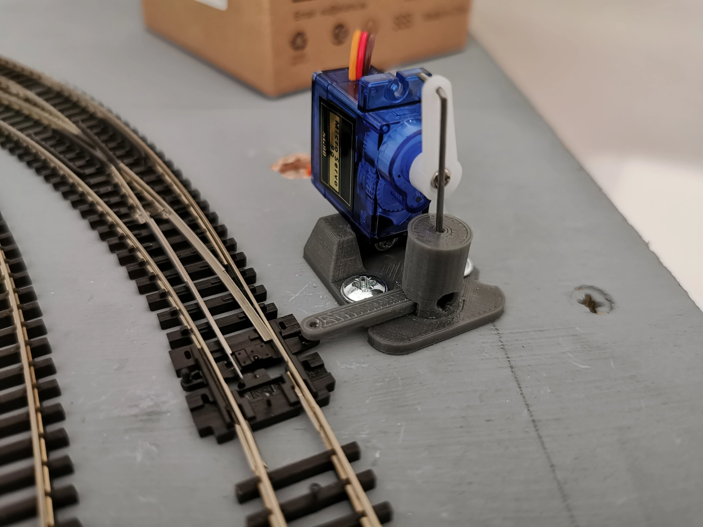
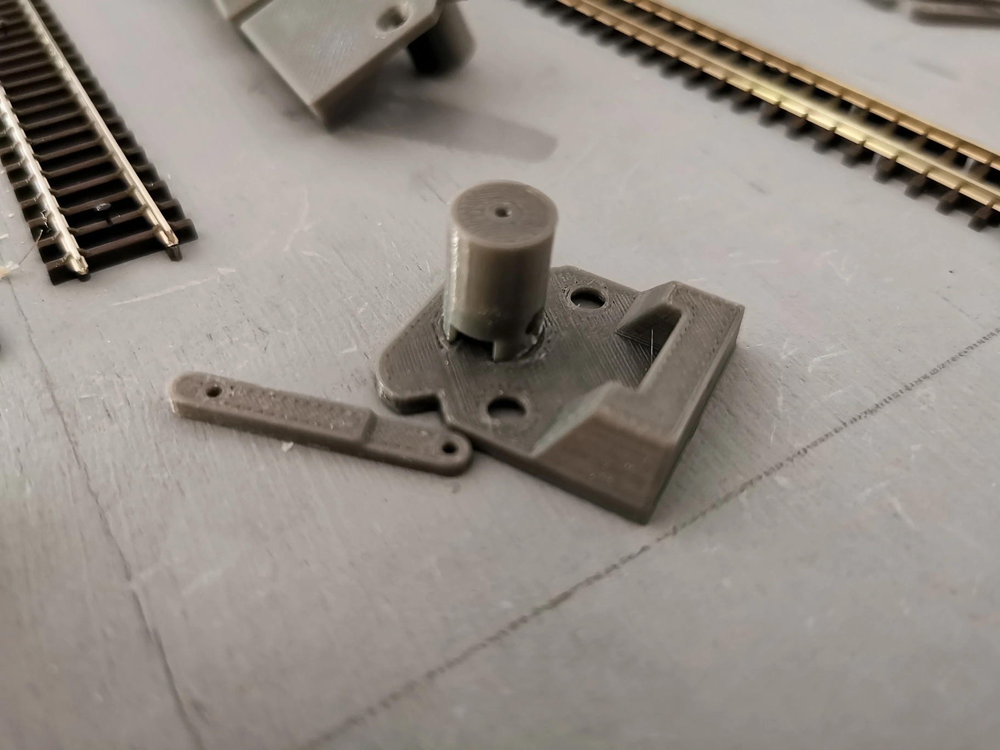
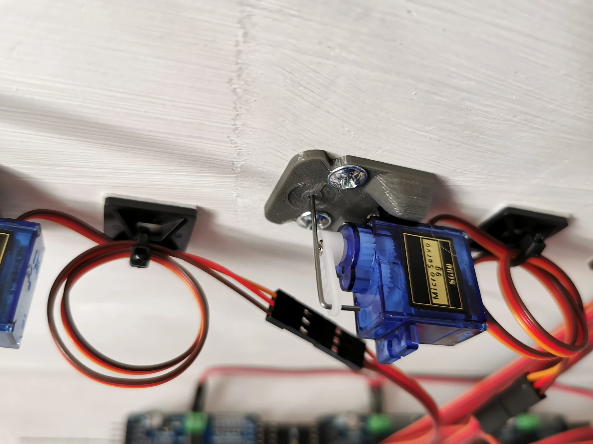
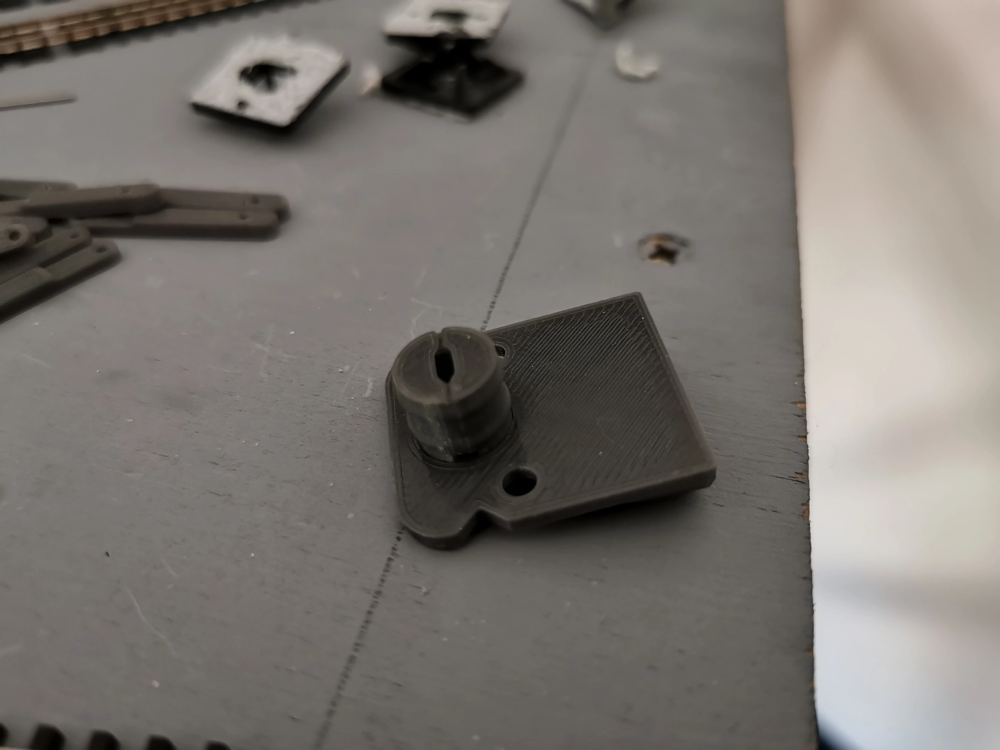

# **M**odel **R**ailway **S**ervo **C**ontroller

Control points, semaphore signals and other accessories using servos.

| :warning: | I'm a C++ hobbyist (Not a pro) and this is a personal project I've shared that will require some tinkering knowledge. While this has worked for me results may vary and you might need to modify the code.| :warning: |
|--|--|--|

| :information_source: | This was developed using Visual Studio Code and PlatformIO but should be Arduino IDE compatible | :information_source: |
|--|--|--|

There's 4 types that have different options
- Point - Has 4 speed options
- Semaphore Signal - Can simulate drop bounce and pull up hesitation
- Sweep - Has 4 speed options (Can be used for gates)
- On\Off - Can be used with N Channel mosfets

Parts:
- Arduino UNO
- LCD Keypad Shield (16x2) (I used this https://www.dfrobot.com/product-51.html)
- MCP23017 I/O Port Expander (I used these https://www.dfrobot.com/product-2002.html)
- PCA9685 PWM Servo Driver

Switches can be ON-ON or ON-OFF, they just need to be latching.

I used SG90 servos as they're cheap and common.

## Config

By default the code is setup to handle 4 MCP23017 boards (addressed as 0x20, 0x21, 0x22 & 0x23) and 4 PCA9685 boards (addressed as 0x40, 0x41, 0x42, 0x43).

If the Keypad you have doesn't work you'll need to check the resistance values as these may vary between manufactures.

# Wiring

To make a simpler install I used MCP23017 & PCA9685 boards with pre-soldered headers.

The MCP23017 expanders are set to input pullups so switches need connecting to GND and one of the input pins.

Unless your boards have DIP switches to change the I2C addresses you'll need to do a bit of soldering.

The boards can then be chained with the SDA & SCL pins on the Uno.

# Servo Numbering

Boards are paired by the order of the addresses in the array.
e.g
```cpp
// MCP's
const uint8_t MCP_ADDRESSES[BOARD_COUNT] = { 0 /* 0x20 */, 1 /* 0x21 */ };
// PCA's'
const uint8_t PCA_ADDRESSES[BOARD_COUNT] = { 0x40, 0x41 }; 
```
The first `MCP` and `PCA` pair will be 0-15 and the second  pair will be 16-31.

# Servo Setup

Servos are a little tricky to setup as the position is unknown to the controller so you'll need to center the servo first (minus the control arm).

- Press *SELECT* on the keypad to start setup.
- You'll first be prompted to select the servo number, use the *UP*/*DOWN* buttons to scroll through the numbers. Press *SELECT* to confirm.
- Press *SELECT* on the first option **Setup/Change**.
- The type can now be selected, **Point**, **Semaphore**, **Sweep**, or **On\Off**. Use the *UP*/*DOWN* buttons to go through the menu options and press *SELECT* on the type you want.
- The servo will now centre.
- After centring you can now fit the arm and the piano wire.
  - For points the arm should be vertical.
  - For semaphore signals the arm should be horizontal.
- You can now set the limits, use the *LEFT*/*RIGHT* buttons to jog the servo in the first direction. When happy with the amount of pressure press *SELECT*. Now go in the opposite direction to set the second limit. Press *SELECT* to confirm.
- You'll then be prompted if the limits are correct. The switch can be toggled at this stage to test, if they are then just press *SELECT* otherwise using the *UP*/*DOWN* buttons you can scroll to **No** and press *SELECT* to go through the limit setup again.
- You'll now be prompted if you want to change the direction the servo operates with the switch. Use *UP*/*DOWN* to change and press *SELECT* to confirm.
- **Point Type**
  - You can now select 1 of 4 speeds. Use the *UP*/*DOWN* buttons to scroll through the speeds. The switch can also be tested so you can give each speed a try. Press *SELECT* to confirm.
- **Semaphore Type**
  - Select if you want to simulate a semaphore signal bounce on drop. You can use the switch the test. Press *SELECT* to confirm.
  - Select if you want to simulate a semaphore hesitate on pull up. You can use the switch the test. Press *SELECT* to confirm.
- **Sweep Type**
  - You can now select 1 of 4 speeds. Use the *UP*/*DOWN* buttons to scroll through the speeds. The switch can also be tested so you can give each speed a try. Press *SELECT* to confirm.
- The display will then read **Setup Complete** before prompting if you want to setup another servo.
If you select **Yes** the servo select will auto increment to the next number so you can just press *SELECT* to continue or use the *UP*/*DOWN* buttons to select a different servo.

## Existing
If you need to change an existing servo.
- Press *SELECT* on the keypad to start setup.
- You'll first be prompted to select the servo number, use the *UP*/*DOWN* buttons to scroll through the numbers. Press *SELECT* to confirm.
- Press *SELECT* on the first option **Setup/Change**.
- If the servo has a previous setup you'll be prompted if you want to overwrite. This allows you to change the type and reset the limits.
- Depending on the type you'll then be able to change the options.

# Servo Mounts

Servos can be mounted with which ever method suits you best but I've included some STL files that can be used to 3D print underside and topside servo mounts (underside needs a 10mm hole for the shaft).

| :warning: | I model in N Gauge so they're sized for that, if you plan on using them for OO/HO they may need tweaking | :warning: |
|--|--|--|





